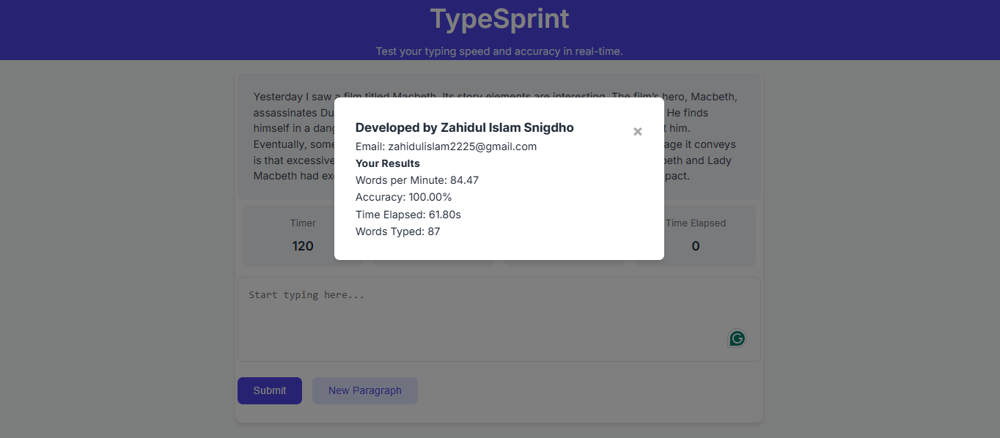
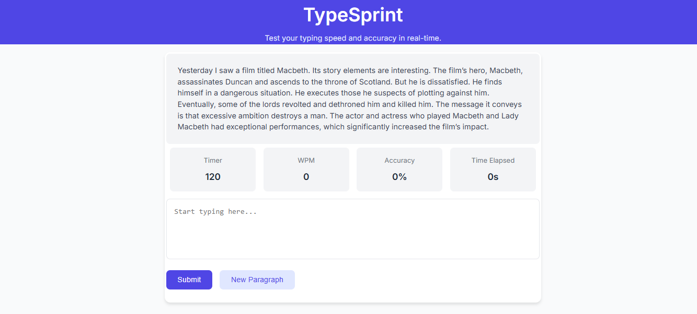

# TypeSprint

TypeSprint is a typing speed checker application built using Flask, HTML, CSS, and JavaScript. It provides real-time feedback on accuracy and words per minute, with a countdown timer and timer for time elapsed. Users can also track their word count and switch between multiple paragraphs by clicking a button.

## Features
- Real-time accuracy and words per minute (WPM) display
- Countdown timer for the typing test
- Timer for tracking time elapsed during typing
- Word count tracker
- Support for multiple paragraphs
- Easy paragraph change by clicking a button

## Technologies Used
- Flask (Python backend)
- HTML, CSS, JavaScript (Frontend)
- jQuery (AJAX requests)

## How to Use
1. Select a paragraph from the provided options or click the "Change Paragraph" button for a new one.
2. Start typing in the input area provided.
3. The real-time accuracy, WPM, time remaining, and time elapsed will be displayed.
4. Submit your typing test to view the results.

## Application Interface
 

 
 

